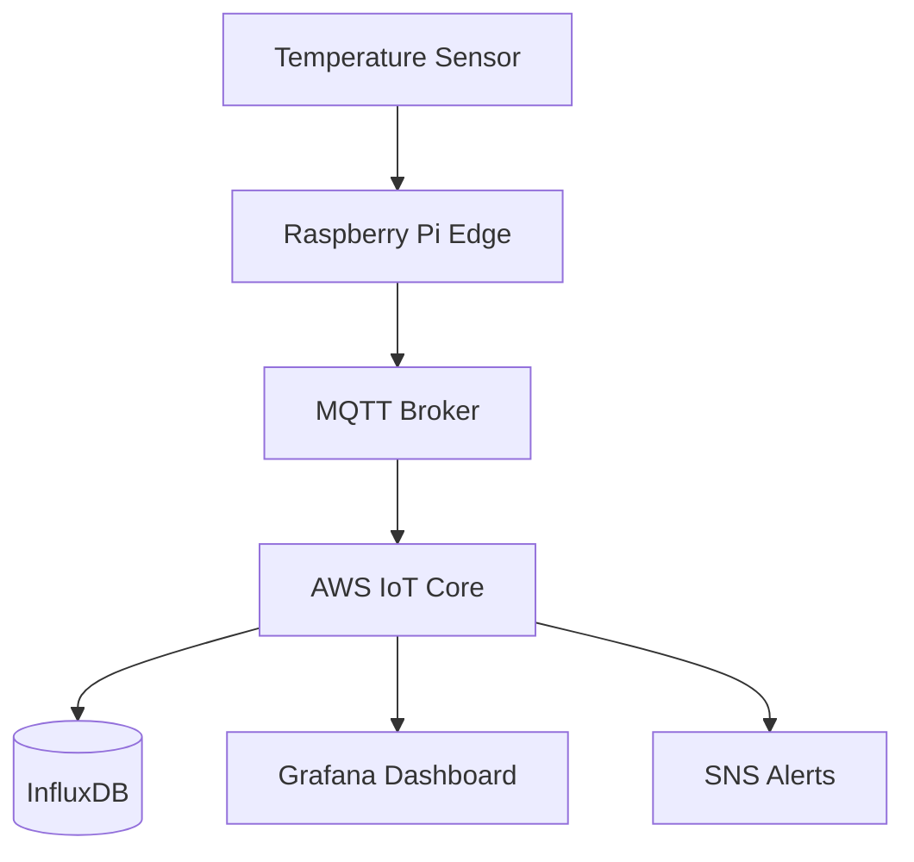

# 🌡️ SmartTemp IoT Sensor Platform

> A cloud-connected temperature monitoring system for industrial environments.

[](https://example.com)
[](LICENSE)

## Overview

SmartTemp is an open-source IoT platform for real-time temperature monitoring.
It supports multiple sensor types, edge computing with Raspberry Pi, and cloud
dashboards via AWS IoT Core.

## Features

- **Multi-sensor support**: DS18B20, DHT22, BME280
- **Edge processing**: Local anomaly detection on Raspberry Pi
- **Cloud integration**: AWS IoT Core, MQTT, WebSocket dashboards
- **Alerts**: Email and SMS notifications via SNS
- **Historical data**: Time-series storage with InfluxDB

## Architecture



## Quick Start

### Prerequisites

- Python 3.10+
- Raspberry Pi 4 (recommended)
- AWS account with IoT Core configured

### Installation

```bash
pip install smarttemp
```

### Configuration

```yaml
sensors:
  - type: DS18B20
    pin: GPIO4
    interval_sec: 30

cloud:
  provider: aws
  region: us-east-1
  thing_name: smarttemp-001

alerts:
  temperature_max: 85.0
  temperature_min: -10.0
```

## API Reference

| Endpoint | Method | Description |
|----------|--------|-------------|
| `/api/readings` | GET | Get latest readings |
| `/api/readings/history` | GET | Get historical data |
| `/api/sensors` | GET | List registered sensors |
| `/api/alerts` | POST | Configure alert rules |

## Performance

| Metric | Value |
|--------|-------|
| Sampling rate | Up to 10 Hz |
| Latency (edge→cloud) | < 500ms |
| Uptime | 99.9% |
| Sensors per gateway | Up to 50 |

## Contributing

1. Fork the repository
2. Create a feature branch
3. Submit a pull request

## License

Apache 2.0 — see [LICENSE](LICENSE) for details.
