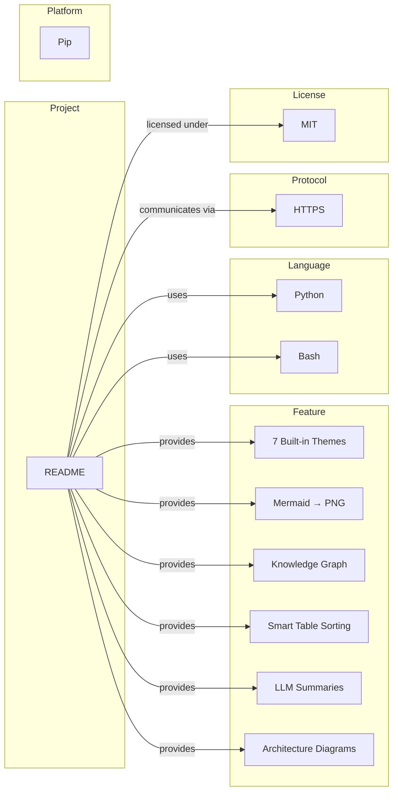

# 🧠 README — Semantic Analysis Report

> Generated by **opendocs** on 2026-02-18 06:50
> Source: `./README.md`

---

## 📊 Knowledge Graph Overview

| Metric | Value |
|--------|-------|
| Total Entities | 12 |
| Total Relations | 10 |
| Deterministic | 12 |
| LLM-Extracted | 0 |
| Project | 1 |
| Protocol | 1 |
| Language | 2 |
| License | 1 |
| Feature | 6 |
| Platform | 1 |

## 🏗️ Entity Catalog

### Projects (1)

| Name | Confidence | Method | Source Section |
|------|-----------|--------|----------------|
| README | 🟢 100% | deterministic | metadata |

### Protocols (1)

| Name | Confidence | Method | Source Section |
|------|-----------|--------|----------------|
| HTTPS | 🟢 90% | deterministic | — |

### Languages (2)

| Name | Confidence | Method | Source Section |
|------|-----------|--------|----------------|
| Python | 🟢 90% | deterministic | — |
| Bash | 🟢 90% | deterministic | — |

### Licenses (1)

| Name | Confidence | Method | Source Section |
|------|-----------|--------|----------------|
| MIT | 🟢 95% | deterministic | — |

### Features (6)

| Name | Confidence | Method | Source Section |
|------|-----------|--------|----------------|
| 7 Built-in Themes | 🟡 75% | deterministic | — |
| Mermaid → PNG | 🟡 75% | deterministic | — |
| Knowledge Graph | 🟡 75% | deterministic | — |
| Smart Table Sorting | 🟡 75% | deterministic | — |
| LLM Summaries | 🟡 75% | deterministic | — |
| Architecture Diagrams | 🟡 75% | deterministic | — |

### Platforms (1)

| Name | Confidence | Method | Source Section |
|------|-----------|--------|----------------|
| Pip | 🟢 80% | deterministic | — |

## 🔗 Relationship Map

| Source | Relation | Target | Confidence |
|--------|----------|--------|-----------|
| README | uses | Python | 90% |
| README | uses | Bash | 90% |
| README | communicates via | HTTPS | 85% |
| README | licensed under | MIT | 95% |
| README | provides | 7 Built-in Themes | 75% |
| README | provides | Mermaid → PNG | 75% |
| README | provides | Knowledge Graph | 75% |
| README | provides | Smart Table Sorting | 75% |
| README | provides | LLM Summaries | 75% |
| README | provides | Architecture Diagrams | 75% |

## 📐 Auto-Generated Architecture Diagram

## 📄 Document Structure

- **Sections:** 1
- **Content Blocks:** 30
- **Mermaid Diagrams:** 0
- **Source Length:** 3,922 characters

### Section Outline

- **� OpenDocs** (2 blocks)
  - **What is OpenDocs?** (2 blocks)
  - **Two Modes** (1 blocks)
  - **Quick Start** (0 blocks)
    - **Install from PyPI** (3 blocks)
    - **Install from source** (1 blocks)
    - **Usage** (4 blocks)
  - **Features** (1 blocks)
  - **Architecture** (1 blocks)
  - **Development** (1 blocks)
  - **Contributing** (1 blocks)
  - **License** (1 blocks)

---
*Report generated by opendocs v0.1 • 2026-02-18 06:50*
